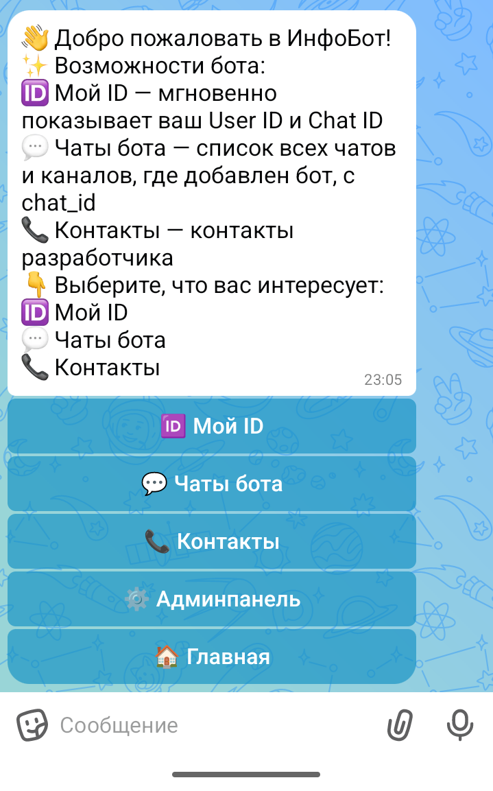
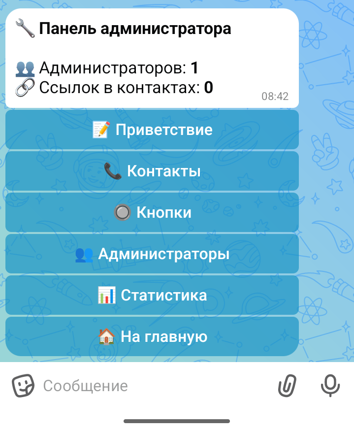
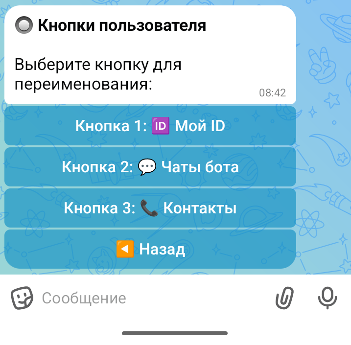
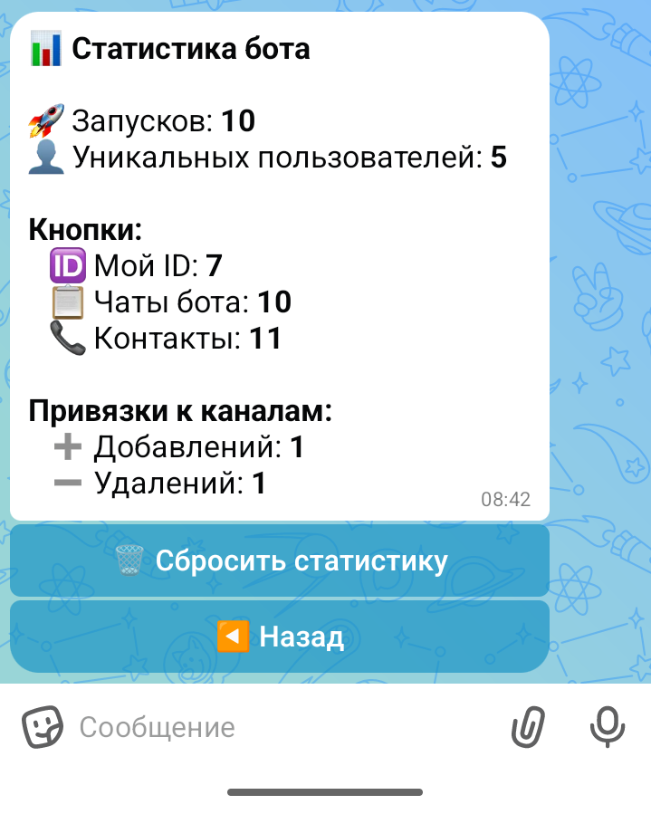

# ИнфоБот для MAX · InfoBot for MAX

### Универсальный чат-бот с админкой для MAX Messenger · Universal info-bot with admin panel for MAX Messenger


---

## 🇷🇺 Русский

Готовый открытый бот для платформы MAX Messenger. Разворачивается на Yandex Cloud Functions + YDB Serverless — без выделенного сервера, платите только за реальные вызовы. Подходит для бизнеса, разработчиков и агентств.

**Все настройки меняются через встроенную админпанель прямо в MAX — без кода и без SSH.**

### Что умеет бот

- **Мой ID** — мгновенный показ User ID и Chat ID пользователя
- **Чаты бота** — список всех чатов и каналов, где добавлен бот, с их chat_id
- **Контакты** — настраиваемый раздел с произвольным текстом и ссылками
- **Статистика** — запуски, уникальные пользователи, клики по кнопкам, привязки к каналам
- **Админпанель** — управление приветствием, кнопками, контактами и администраторами без кода

### Для кого

- **Разработчикам** — быстрый отладчик: User ID и Chat ID за секунды
- **Бизнесу** — информационный бот с навигацией, контактами и статистикой
- **Агентствам** — white label решение: тексты и кнопки меняются через интерфейс

---

## 🇺🇸 English

A ready-made open-source bot for MAX Messenger. Runs on Yandex Cloud Functions + YDB Serverless — no dedicated server required, you pay only for actual invocations.

**All settings are managed through the built-in admin panel directly in MAX — no code, no SSH.**

### Features

- **My ID** — instant User ID and Chat ID display
- **Bot chats** — list of all chats and channels the bot is added to, with chat_id
- **Contacts** — configurable section with custom text and links
- **Statistics** — launches, unique users, button clicks, channel bindings
- **Admin panel** — manage greeting, buttons, contacts and admins without touching code

---

## 🖥 Скриншоты · Screenshots

   

---

## 📁 Структура · Structure

```
├── main.py          # Entry point → handler(event, context)
├── config.py        # 4 environment variables
├── database.py      # YDB: table creation + all CRUD
├── handlers.py      # All bot logic
├── keyboards.py     # Keyboards
└── requirements.txt # requests, ydb
```

---

## 🚀 Быстрый старт · Quick start

### Переменные окружения · Environment variables

| Variable | Where to get |
|---|---|
| `BOT_TOKEN` | MAX → business.max.ru → Чат-боты → Интеграция |
| `YDB_DOCAPI_ENDPOINT` | YDB Console → Document API endpoint |
| `INITIAL_ADMIN_ID` | Your user_id in MAX (needed once at first run) |

### Деплой · Deploy

**1. Создай YDB Serverless базу** на [console.cloud.yandex.ru](https://console.cloud.yandex.ru) → Managed Service for YDB → тип **Serverless**. Таблицы создадутся автоматически при первом запуске.

**2. Создай Cloud Function** → среда Python 3.12 → загрузи ZIP-архив → точка входа `main.handler` → добавь переменные окружения.

**3. Создай API Gateway** с маршрутом `/webhook` → Cloud Function.

**4. Зарегистрируй вебхук в MAX:**
```bash
curl -X POST "https://platform-api.max.ru/subscriptions" \
  -H "Authorization: ВАШ_BOT_TOKEN" \
  -H "Content-Type: application/json" \
  -d '{
    "url": "https://xxxxxx.apigw.yandexcloud.net/webhook",
    "update_types": ["message_created", "message_callback", "bot_started"]
  }'
```

**5. Напиши боту `/start`** — готово.

> 📄 Полная инструкция с каждым шагом — в файле [DEPLOY.md](DEPLOY.md)

### Упаковка в ZIP · Pack to ZIP
```bash
cd max_bot/
zip -r ../max_bot.zip . -x "*.pyc" -x "__pycache__/*"
```

---

## 🗃 Таблицы YDB · YDB Tables

| Table | Contents |
|---|---|
| `bot_config` | Greeting, button names, contacts text |
| `contacts_links` | Links in the Contacts section |
| `admins` | Admin user_ids |
| `admin_states` | Temporary FSM states during editing |

---

## 🌐 Контакты · Contacts

- 🌐 [shashevpro.ru](https://www.shashevpro.ru)
- 🛒 [kwork.ru/user/shashevpro](https://kwork.ru/user/shashevpro)
- ✉️ programmer@shashevpro.ru
- 💬 [vk.com/shashevpro](https://vk.com/shashevpro)

---

<div align="center">

**© ShashevPro · Andrey Shashev** — open source, MIT license.

</div>
